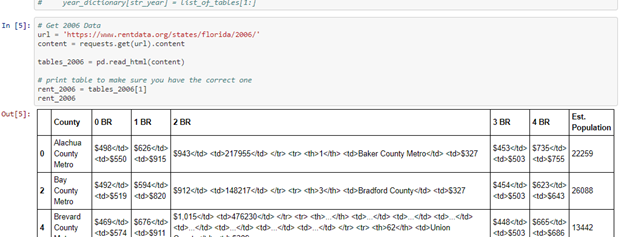
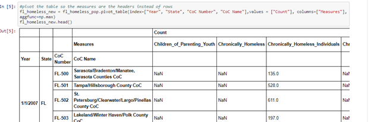

## Local Data ETL Project Outline

The purpose of this project is to extract, transform, and load data in preparation for a future project. The data will be used for the Warehousing the Housing Crisis Repo. 

* **Extraction**

  * Extracted data from multiple sources using different formats: 
    * CSV files
    * Webscrapping

* Where data is coming from: 
  * Median Income Florida - IRS
  * Avg Home Price in Florida - Zillow / MLS
  * Homelessness Rates in Florida - HUD
  * Median Rent Florida - Census Bureau 
  

* **Transform**

  * Transform csv files by renaming columns, eliminating columns, and merging columns. 

  * Identify keys to connect all data in SQLite.

* **Load**

  * Create a connection to SQLite.
  * Confirm connection with query.

## Contributions and Resources:

Kristina - Median rental rates 2005-2015:
https://www.rentdata.org/states/florida/2020
https://www.deptofnumbers.com/rent/florida/

Melissa - Homelessness rates 2005-2015:
https://www.kaggle.com/adamschroeder/homelessness 

Asia - Avg home prices in Florida 2005-2015:
CSV/Excel Sheet procured from Zillows datawiz site
https://www.zillow.com/research/data/
Median income Florida 2005-2015
https://www.census.gov/acs/www/data/data-tables-and-tools/data-profiles/2015/
